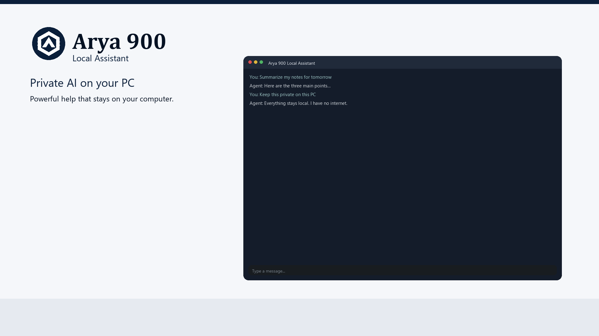
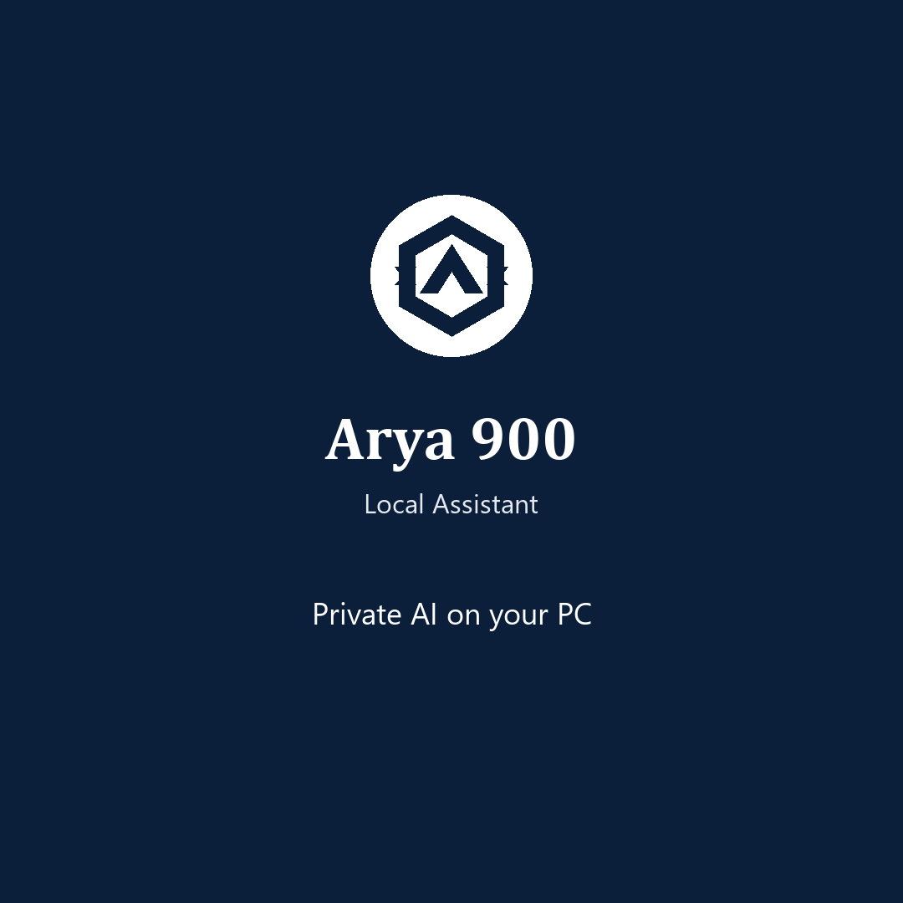
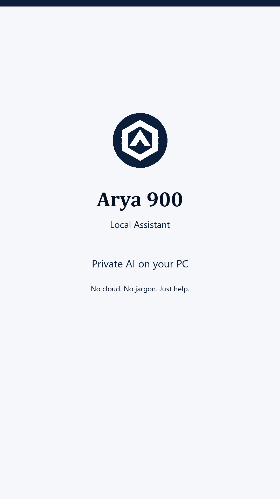
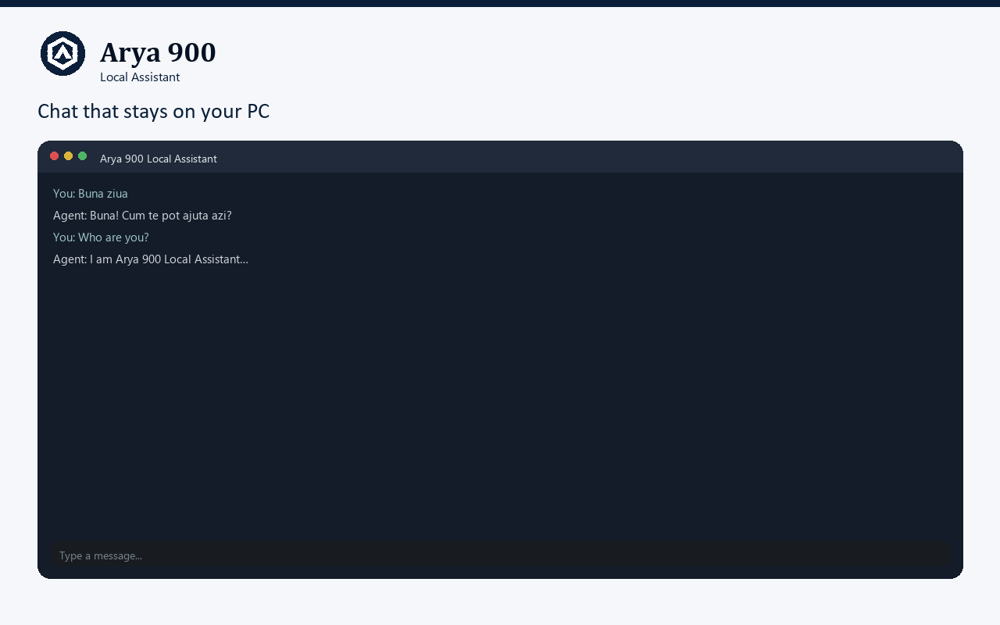
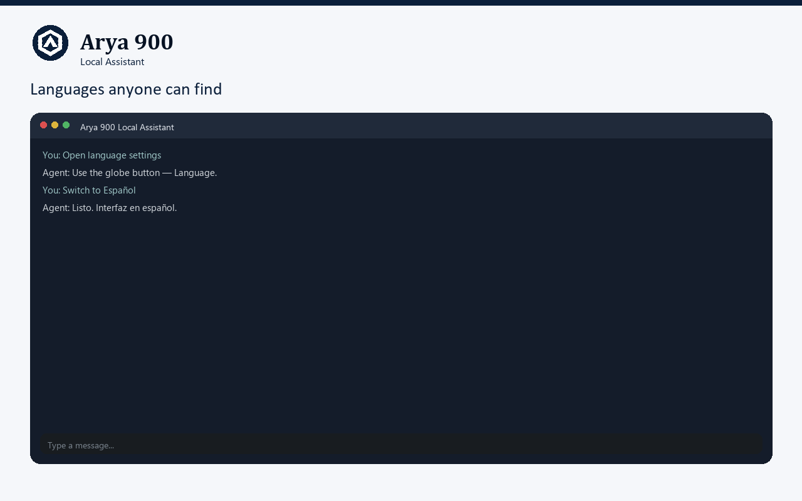

# Arya 900 Local Assistant

**Private AI on your PC** — offline Windows desktop chat with local GGUF models.

Publisher: **EAROCO SERVICES SRL - ANDREI BUJAKI**

---

## Contents

1. [Download (Free)](#download-free)
2. [What it is](#what-it-is)
3. [Plans](#plans)
4. [Install](#install)
5. [Media & social kit](#media--social-kit)
6. [Requirements](#requirements)
7. [Docs](#docs)
8. [Legal](#legal)
9. [Support](#support)
10. [About this repository](#about-this-repository)

---

## Download (Free)

**→ [Latest Free release](https://github.com/andreibujaki/arya900/releases/latest)**

| Item | Detail |
|------|--------|
| Artifact | `Arya 900 Local Assistant Free` / `Arya.900.Local.Assistant.Free` Windows x64 installer |
| Version | See [Releases](https://github.com/andreibujaki/arya900/releases) |
| Code signing | Not yet — SmartScreen / WDAC may warn (signing later) |

---

## What it is

Arya 900 Local Assistant runs **on your PC**:

- Chat with **local GGUF** models (no cloud required for Free chat)
- Windows desktop app (installer)
- Free tier for **personal, non-commercial** light use

Pro and Business unlocks (Knowledge folder, tools, org use) are planned for later releases.

---

## Plans

| Plan | Status | What you get |
|------|--------|----------------|
| **Free** | Available now | Personal light use; local chat |
| **Pro** | Coming later | Knowledge folder & file tools |
| **Business** | Coming later | Organizational / Project use |

Upgrade links in the app will activate when Pro goes live.

---

## Install

1. Open the [latest Release](https://github.com/andreibujaki/arya900/releases/latest)
2. Download the **Free** `.exe` installer
3. Run the installer and finish the wizard
4. Launch **Arya 900 Local Assistant Free**
5. Choose or download a local GGUF model and start chatting

If Windows blocks the file: use “More info” → Run anyway (unsigned build), or wait for a signed release.

More detail: [docs/install.md](docs/install.md)

---

## Media & social kit

Full pack (marks, wordmarks, social sizes, store frames, brand sheet): **[brand/](brand/)**

| Preview | Asset |
|---------|--------|
|  | [social-1x1.png](brand/marketing/social-1x1.png) |
|  | [social-story-9x16.png](brand/marketing/social-story-9x16.png) |

Store frames:

  
  
  

Guide: [brand/README.md](brand/README.md)

---

## Requirements

Summary:

- **OS:** Windows 10 or 11, **x64**
- **Disk:** space for the app + your GGUF models
- **GPU:** optional NVIDIA for faster inference (CPU works)

Full notes: [docs/requirements.md](docs/requirements.md)

---

## Docs

| Doc | Description |
|-----|-------------|
| [Install](docs/install.md) | Installer steps & common Windows warnings |
| [Requirements](docs/requirements.md) | System requirements |
| [FAQ](docs/faq.md) | Frequent questions |
| [Changelog](docs/changelog.md) | Public release history |
| [Media & brand kit](brand/README.md) | Logos, social, store art |

---

## Legal

| Document | EN | RO |
|----------|----|----|
| EULA | [EN](legal/EULA.en.md) | [RO](legal/EULA.ro.md) |
| Privacy | [EN](legal/PRIVACY.en.md) | [RO](legal/PRIVACY.ro.md) |
| Subscription terms | [EN](legal/SUBSCRIPTION.en.md) | [RO](legal/SUBSCRIPTION.ro.md) |

Product license notice: [LICENSE](LICENSE) (proprietary — **not** open source).

---

## Support

- Prefer questions on the [Releases](https://github.com/andreibujaki/arya900/releases) page for the version you installed
- Bug reports: use [GitHub Issues](https://github.com/andreibujaki/arya900/issues) with the bug template
- Publisher contact appears in the [Privacy notice](legal/PRIVACY.en.md)

---

## About this repository

This repository is the **public product face**:

- Downloadable **Free** builds (Releases)
- Marketing / social media kit
- Legal text

**Application source code is not published here.**
